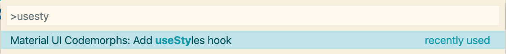

# @vscodeshift/material-ui-codemorphs

[](https://circleci.com/gh/vscodeshift/material-ui-codemorphs)
[](https://codecov.io/gh/vscodeshift/material-ui-codemorphs)
[](https://github.com/semantic-release/semantic-release)
[](http://commitizen.github.io/cz-cli/)
[](https://marketplace.visualstudio.com/items?itemName=vscodeshift.material-ui-codemorphs)

sweet codemod commands for everyday work with Material UI ✨

# Commands

## Add useStyles hook

Position the cursor inside a funcitonal component before running this command.

Wraps the functional component in `withStyles`,
adds a `const styles = (theme: Theme) => ({ })` declaration,
and adds a `classes` type annotation and prop destructuring if possible.

Supports Flow, TypeScript, and plain JS!

### Configuration

You can override where the `Theme` type is imported from by adding the following to your `package.json`:

```json
{
  "material-ui-codemorphs": {
    "themeImport": "import { type Theme } from './src/universal/theme'"
  }
}
```

You can override where `makeStyles` is imported from by adding the following to your `package.json`:

```json
{
  "material-ui-codemorphs": {
    "makeStylesImport": "import { makeStyles } from '@material-ui/core'"
  }
}
```

### Example

```tsx
import * as React from 'react'

interface Props {
  text: string
}

export const Test = ({ text }: Props): React.ReactNode => <div>{text}</div>
```



```diff
import * as React from 'react'

+ import { makeStyles, Theme } from '@material-ui/core/styles'

interface Props {
  text: string
}

+ const useStyles = makeStyles((theme: Theme) => ({}))

- export const Test = ({ text }: Props): React.ReactNode => (
-   <div>{text}</div>
- )
+ export const Test = ({ text }: Props): React.ReactNode => {
+   const classes = useStyles()
+   return <div>{text}</div>
+ }
```

## Wrap in withStyles

Position the cursor inside a component before running this command.

Wraps the component in `withStyles`,
adds a `const styles = (theme: Theme) => ({ })` declaration,
and adds a `classes` type annotation and prop destructuring if possible.

Supports Flow, TypeScript, and plain JS!

### Configuration

You can override where the `Theme` type is imported from by adding the following to your `package.json`:

```json
{
  "material-ui-codemorphs": {
    "themeImport": "import { type Theme } from './src/universal/theme'"
  }
}
```

You can override where `withStyles` is imported from by adding the following to your `package.json`:

```json
{
  "material-ui-codemorphs": {
    "withStylesImport": "import { withStyles } from '@material-ui/core'"
  }
}
```

### Example

```tsx
import * as React from 'react'

interface Props {
  text: string
}

const Test = ({ text }: Props): React.ReactNode => {
  return <div>{text}</div>
}
```


```diff
import * as React from 'react'

+ import { withStyles, Theme, WithStyles } from '@material-ui/core/styles'

- interface Props {
+ interface Props extends WithStyles<typeof styles> {
  text: string
}

+ const styles = (theme: Theme) => ({})

- const Test = ({ text }: Props): React.ReactNode => {
+ const TestWithStyles = ({ text, classes }: Props): React.ReactNode => {
  <div>{text}</div>
}

+ const Test = withStyles(styles)(TestWithStyles)
```

## Box (Set up @material-ui/system)

Creates/updates the declaration for `Box` based upon which props you pass to
`<Box>` elements in your code.

### Example

```js
import * as React from 'react'
const Foo = () => (
  <Box
    sm={{ marginLeft: 2, fontSize: 12 }}
    md={{ marginLeft: 3, fontSize: 16 }}
  />
)
const Bar = () => <Box boxShadow={1} />
```


```diff
import * as React from 'react'
+ import { styled } from '@material-ui/styles'
+ import {
+   spacing,
+   typography,
+   shadows,
+   breakpoints,
+   compose,
+ } from '@material-ui/system'
+ const Box = styled('div')(breakpoints(compose(shadows, spacing, typography)))
const Foo = () => (
  <Box
    sm={{ marginLeft: 2, fontSize: 12 }}
    md={{ marginLeft: 3, fontSize: 16 }}
  />
)
const Bar = () => <Box boxShadow={1} />
```
